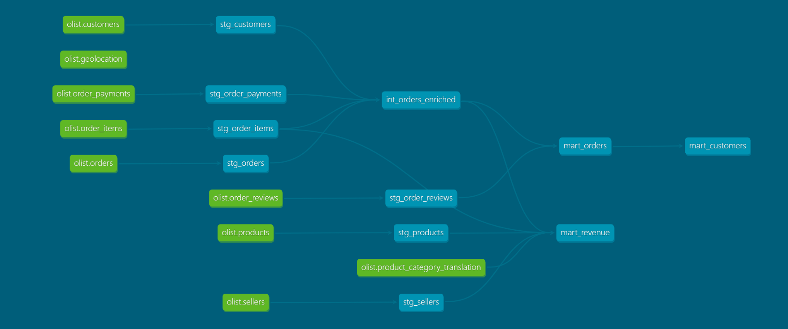

# Olist E-Commerce Analytics

> A production-style analytics engineering project built with **dbt Core** and **BigQuery**,
> using the public Olist Brazilian E-Commerce dataset (~100k real orders from 2016–2018).


---

## Overview

This project demonstrates a full analytics engineering workflow — from raw source data
through layered SQL transformations to business-ready reporting tables, with data quality
testing and auto-generated documentation throughout.

The pipeline is structured around three transformation layers following dbt best practices:
raw sources are never modified, staging models clean and rename, intermediate models join
and enrich, and mart models serve as the final consumption layer.

---

## DAG — Lineage Graph



---

## Architecture

```text
[Kaggle: Olist CSV files]
│
▼
[BigQuery: olist_raw]        ← raw source tables, never modified
│
▼
┌─────────────────────────────────────────┐
│             dbt Pipeline                │
│                                         │
│  Staging        7 models  (views)       │
│  Intermediate   1 model   (view)        │
│  Marts          3 models  (tables)      │
└─────────────────────────────────────────┘
│
▼
[BigQuery: olist_dev]        ← transformed, business-ready tables
```

---

## Tech Stack

| Layer | Tool |
|-------|------|
| Transformation | dbt Core 1.11 |
| Warehouse | Google BigQuery |
| Data Cleaning | Python 3.13, Pandas |
| Version Control | Git, GitHub |

---

## Project Structure

```text
olist_analytics/
├── models/
│   ├── staging/               # Clean and rename raw sources
│   │   ├── sources.yml        # Source declarations
│   │   ├── schema.yml         # Column tests and descriptions
│   │   ├── stg_orders.sql
│   │   ├── stg_customers.sql
│   │   ├── stg_order_items.sql
│   │   ├── stg_order_payments.sql
│   │   ├── stg_order_reviews.sql
│   │   ├── stg_products.sql
│   │   └── stg_sellers.sql
│   ├── intermediate/          # Business logic and joins
│   │   └── int_orders_enriched.sql
│   └── marts/                 # Final reporting tables
│       ├── mart_orders.sql
│       ├── mart_revenue.sql
│       ├── mart_customers.sql
│       └── schema.yml
├── upload_reviews.py          # Source data cleaning utility
├── dbt_project.yml
└── .gitignore
```

---

## Marts

### `mart_orders`
Order-level fact table combining delivery performance, payment data,
and customer sentiment. One row per order.

Key fields: `order_id` · `delivery_status` · `is_on_time` · `days_to_deliver`
· `payment_total` · `sentiment`

---

### `mart_revenue`
Revenue aggregated by month, product category, seller, and geography.
Built for commercial trend analysis.

Key fields: `purchase_month` · `category_name_english` · `gross_revenue`
· `total_revenue` · `order_count`

---

### `mart_customers`
One row per unique customer with lifetime value metrics and behavioural
segmentation (one-time / repeat / loyal).

Key fields: `customer_unique_id` · `total_spend` · `avg_order_value`
· `customer_segment` · `on_time_pct`

---

## Key Findings

###  Top 5 Revenue Categories
Across ~97k delivered orders, health and lifestyle categories dominate:

| Rank | Category | Gross Revenue | Orders |
|------|----------|--------------|--------|
| 1 | Health & Beauty | R$1,233,132 | 8,674 |
| 2 | Watches & Gifts | R$1,166,177 | 5,531 |
| 3 | Bed, Bath & Table | R$1,023,435 | 9,481 |
| 4 | Sports & Leisure | R$954,853 | 7,582 |
| 5 | Computers & Accessories | R$888,725 | 6,603 |

---

###  Delivery Performance
The platform maintains a strong on-time delivery rate across all orders:

| Status | Orders | Share |
|--------|--------|-------|
| On Time | 88,644 | 91.9% |
| Late | 7,834 | 8.1% |

Over 9 in 10 orders arrive on or before the estimated delivery date —
a strong operational result for a marketplace of this scale.

---

###  Customer Segmentation
The vast majority of customers are one-time buyers, but repeat and loyal
customers spend significantly more per order:

| Segment | Customers | Avg Lifetime Spend | Avg Order Value |
|---------|-----------|-------------------|----------------|
| One-time | 90,557 | R$160.76 | R$160.76 |
| Repeat (2–3 orders) | 2,754 | R$300.38 | R$145.44 |
| Loyal (4+ orders) | 47 | R$789.42 | R$170.72 |

Loyal customers generate nearly 5x the lifetime value of one-time buyers,
highlighting strong retention potential for a relatively small cohort.

---

###  Revenue Trend (Latest 6 Months)
Revenue remained consistently strong through mid-2018, with May being
the peak month in the period:

| Month | Gross Revenue | Orders |
|-------|--------------|--------|
| Aug 2018 | R$838,577 | 6,480 |
| Jul 2018 | R$867,953 | 6,269 |
| Jun 2018 | R$856,078 | 6,221 |
| May 2018 | R$977,545 | 6,878 |
| Apr 2018 | R$973,534 | 6,944 |
| Mar 2018 | R$953,356 | 7,110 |
---

## Data Quality

29 dbt tests across all models covering uniqueness, nullability,
and accepted value ranges.

| Result | Count |
|--------|-------|
| ✅ Passed | 27 |
| ⚠️ Warned | 2 |
| ❌ Failed | 0 |

The 2 warnings are on `stg_order_reviews` — null values present in the
source data due to malformed rows in the original CSV. These are handled using `safe_cast` 
and `on_bad_lines='skip'` in the cleaning
script, and documented as known data quality issues.

---

## Running This Project

### Prerequisites

- Python 3.8+
- dbt Core with BigQuery adapter

```bash
pip install dbt-bigquery
```

- Google Cloud account with BigQuery enabled
- Service account with `BigQuery Data Editor` and `BigQuery Job User` roles

### Setup

**1. Clone the repository**
```bash
git clone https://github.com/alexscutelnic/olist-analytics.git
cd olist-analytics
```

**2. Configure your dbt profile**

Add the following to `~/.dbt/profiles.yml`:

```yaml
olist_analytics:
  target: dev
  outputs:
    dev:
      type: bigquery
      method: service-account
      project: your-gcp-project-id
      dataset: olist_dev
      threads: 4
      timeout_seconds: 300
      keyfile: /path/to/your/service-account-key.json
```

**3. Load source data**

Download the [Olist dataset from Kaggle](https://www.kaggle.com/datasets/olistbr/brazilian-ecommerce)
and load the CSV files into a BigQuery dataset named `olist_raw`.
Use `upload_reviews.py` to clean and load the reviews table which contains
malformed rows in the original source.

**4. Run the pipeline**

```bash
dbt debug                              # verify connection
dbt run                                # build all 11 models
dbt test                               # run 29 data quality tests
dbt docs generate && dbt docs serve    # view docs and DAG
```

---

## Dataset

[Brazilian E-Commerce Public Dataset by Olist](https://www.kaggle.com/datasets/olistbr/brazilian-ecommerce)
— ~100k orders placed on the Olist marketplace between 2016 and 2018,
made publicly available by Olist for research and learning purposes.

---

## License

MIT